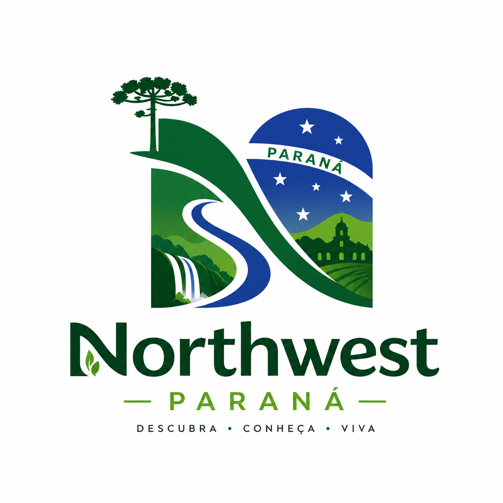

<p align="center">
  
</p>

<h1 align="center">Northwest Paraná — Tourism Guide</h1>

<p align="center">
  <em>A visual guide to the natural, historical and cultural beauty of Northwest Paraná, Brazil —<br>
  from the towering cathedral of Maringá to the freshwater beaches of the Paraná River.</em>
</p>

<p align="center">
  <a href="https://northwest-parana.vercel.app"></a>
</p>

<p align="center">
  
  
  
  
  
</p>

---

## 📖 About

**Northwest Paraná** is an interactive web guide that celebrates the towns and hidden gems of the northwest region of Paraná — a part of Brazil that rarely gets its own spotlight. It began as a **school project** and grew into a real, published product: a single-page app that lets anyone browse **70 cities** and discover **242 real places worth visiting**, each with live ratings, photos, and a one-tap link to Google Maps.

> The goal was simple but personal: put my region on the map — literally — and tell its story through code.

## ✨ Features

| | |
|---|---|
| 🗺️ **70 cities** | The full northwest microregion, grouped by hub (Maringá, Paranavaí, Umuarama, Cianorte, Campo Mourão) |
| ⭐ **242 verified places** | Real attractions, parks, and restaurants with Google ratings and review counts |
| 📸 **Photo for every card** | 240+ locally hosted, optimized images |
| 🔍 **Instant search & filters** | Find any city or place, filter by microregion |
| 📱 **Fully responsive** | Built mobile-first, works from phones to desktops |
| ⚡ **Fast by design** | Lazy-loaded images so pages feel instant |
| ♿ **Keyboard & touch friendly** | Arrow-key navigation and swipe gestures |

## 🛠️ How it was built

This project is intentionally **framework-free** — pure HTML, CSS, and vanilla JavaScript — to keep it lightweight and to practice the fundamentals.

The most interesting part is the **data pipeline** behind those 242 places:

1. **Collection** — Real place data was pulled from Google Maps using the [Bright Data](https://brightdata.com) Web Scraper API (`discover_by=location`), gathering **600+ candidate places** across all 70 cities.
2. **Geo-validation** — Location search "bleeds" into bigger, similarly named cities (a query for a tiny town would return results from far away). Every place was validated against its **address, state, and coordinates**, which filtered ~half of the raw results down to **245 trustworthy entries**.
3. **Curation** — Non-touristy categories (hospitals, bus terminals, offices) were removed, duplicates merged, and machine-translated names corrected back to Portuguese.
4. **Image optimization** — Photos were downloaded, recompressed (**48 MB → 23 MB**, ~53% smaller), and paired with **lazy loading** so only the visible card fetches its image.
5. **Deploy** — Continuously deployed to **Vercel** from the `main` branch.

## 🧰 Tech Stack

- **Frontend:** HTML5, CSS3 (custom properties, grid, flexbox), vanilla JavaScript (ES6+)
- **Data:** JSON dataset generated from a Google Maps scraping + validation pipeline (Python)
- **Hosting:** Vercel

## 📁 Project Structure

```
├── index.html        # The whole app: markup, styles, and carousel logic
├── dados.js          # City dataset + curation logic
├── lugares.js        # 242 verified places (name, rating, address, coords, photo)
└── imagens/
    ├── lugares/      # Optimized place photos
    ├── bandeiras/    # City flags (fallback for towns without a place yet)
    └── logo.png
```

## 🚀 Running Locally

No build step, no dependencies — just serve the folder:

```bash
git clone https://github.com/bel1ni/northwest-parana.git
cd northwest-parana
python -m http.server 8000
```

Then open <http://localhost:8000>.

## 👩‍💻 Author

**Mariane Belini** — student & aspiring web developer from Paraná, Brazil.

- 🌐 Live project: [northwest-parana.vercel.app](https://northwest-parana.vercel.app)
- 💼 GitHub: [@bel1ni](https://github.com/bel1ni)

## 📝 Notes

Place data and photos are sourced from Google Maps and used here for educational, non-commercial purposes. City flags are official municipal symbols.

---

<p align="center"><sub>Feito com 💚 no Noroeste do Paraná • Made with 💚 in Northwest Paraná</sub></p>
